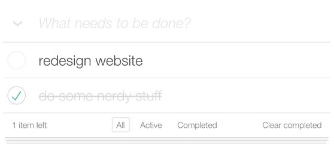

# Teste front-end

Bem-vindo ao teste para desenvolvimento front-end.

## O teste

Para testar suas habilidades em TypeScript e folhas de estilos, nos baseamos no projeto [Todo MVC](https://todomvc.com).

Neste teste você poderá mostrar suas habilidades em gerência de estados, listas utilizando `map`, `filter`..

O foco deste teste é a implementação de uma lista de tarefas, onde você deve listar, criar, mudar o título, mudar o estado para concluído ou não.
